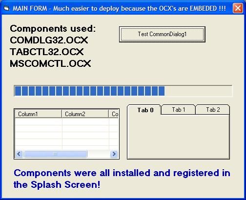



## Setup OCX in Splash Screen

### Description

Setup OCX files in your Splash Screen. The OCX files were EMBEDDED into Modules using the Resource Builder Application I recently posted in PSC.  This is a real working example of COMDLG32.OCX, TABCTL32.OCX and MSCOMCTL.OCX being automatically installed by the Splash Screen. This makes Internet Software Delivery possible even when they run your App straight out of the Zip file. Great when distributing to users who have no technical knowledge or are new to Windows. How often do you find that a user executes the SETUP from within the Zip instead of extracting all the files first into a temp folder? This app does it all! Enjoy.
 
### More Info
 

             |
---                |---
**Submitted On**   |2006-04-16 15:52:54
**By**             |[Kevin Ritch](https://github.com/Planet-Source-Code/PSCIndex/blob/master/ByAuthor/kevin-ritch.md)
**Level**          |Advanced
**User Rating**    |5.0 (10 globes from 2 users)
**Compatibility**  |VB 5\.0, VB 6\.0
**Category**       |[Complete Applications](https://github.com/Planet-Source-Code/PSCIndex/blob/master/ByCategory/complete-applications__1-27.md)
**World**          |[Visual Basic](https://github.com/Planet-Source-Code/PSCIndex/blob/master/ByWorld/visual-basic.md)
**Archive File**   |[Setup\_OCX\_1987594162006\.zip](https://github.com/Planet-Source-Code/kevin-ritch-setup-ocx-in-splash-screen__1-65026/archive/master.zip)

